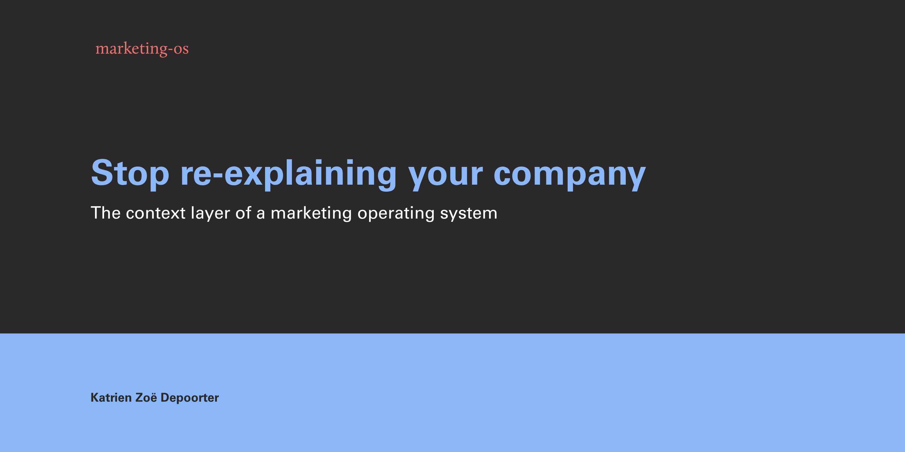
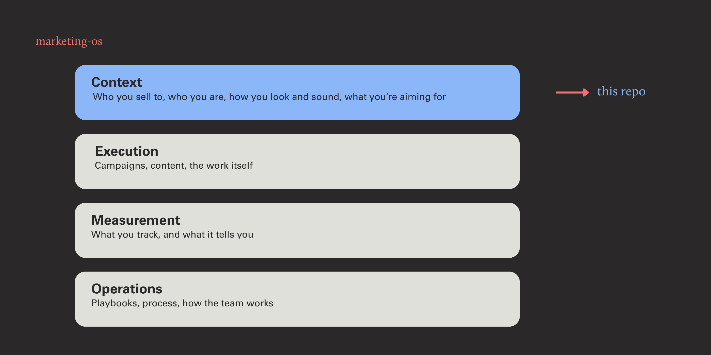

# marketing-os

A marketing operating system covers a lot of ground: positioning, campaigns, content, budgets, numbers, playbooks, the way a team works.

This repo is one layer of it. The one everything else depends on: **context**. What a company knows about itself, written down so every piece of work starts from the same place instead of from scratch.

## Where this fits

A marketing OS has four layers:

- **Context**: what the company knows about itself. ICP, positioning, brand and voice, competitors, goals.
- **Execution**: campaigns, content, assets, customer stories, the work itself.
- **Measurement**: what you track, and what it's telling you.
- **Operations**: playbooks, process, how the team actually works.




Context comes first, because every other layer reads from it. Get the positioning wrong and every campaign inherits the mistake.

This repo holds that layer, and only that layer, because it's the part that's useful to someone else empty. A blank ICP framework still helps you think. A blank playbook is a table with headers.

Some of the other layers will follow. Others won't: process, team frameworks and playbooks are only worth anything when they come from actually having done the work.

It is not software. Nothing to install. Six markdown files and the discipline to keep them current.

## The problem this solves

**Marketing context is scattered by default.** Forty files across five tools, half of them out of date, and one person who knows where everything is. Everyone works from a slightly different version, so every asset drifts a little further from the last.

**AI multiplies whatever it's given.** Agents don't fix a thin or out-of-date foundation. They produce more from it, faster.

**Undocumented context caps your speed.** Start building an engine and you add hands: a first hire, a freelancer, an agency, a few agents. Every one of them needs the same context, and if it isn't written down, you are the only place to get it. Sales, product and support too, all describing the same company to the same buyers, usually from different versions of it.

Written context is what lets you add hands without losing the plot.

## Who it's for

- **Startups getting ready to grow.** One or two marketers today, but preparing for the next phase. This is where undocumented context stops being fine and starts being the thing slowing you down.
- **Marketing leads walking into that.** There's no discovery phase and then a doing phase. Filling this in is the discovery, and work comes out of it while you're still filling it in.
- **Small teams** re-answering the same questions every quarter because nobody wrote the answer down.
- **Anyone using AI for marketing** who is tired of re-explaining the company at the start of every session.
- **Freelancers and consultants** who need to hand over a working system, not a folder of deliverables.

If you already have a rigorous, current, single source of truth for positioning and voice, you don't need this. Most people don't.

## Status

Context layer: live. More will follow, selectively.

## What's in here

```
CLAUDE.md              → the spine. Top-line context, always loaded first.
context/
  business-context.md  → who we are, what we do, who we sell to, the rules
  competitors.md       → the landscape, per-competitor profiles, white space
  brand-guidelines.md  → brand core, visual identity, voice and writing rules
  expert-pov.md        → founder beliefs, contrarian takes, the one big idea
  goals.md             → targets and KPIs, as context work can point at
example/               → all of the above filled in, plus what came out of it
```

Six files. That's the foundation. Everything else reads from it.

## See it filled in

**Start here:** [`example/output/campaign-brief.md`](example/output/campaign-brief.md). Same one-sentence prompt, run twice. Once without the context, once with. The difference is the whole argument.

`example/` has the whole thing done for a fictional company: six files filled, plus three artifacts produced from them. A positioning statement, a LinkedIn post in the founder's voice, and a Q3 campaign brief.

Each artifact ends with a table showing where every element came from. The campaign brief rules out paid social and a Spanish launch, targets a named list of 600 club owners, builds around an insight about empty Tuesday afternoons, and flags that the founder is the bottleneck. None of that was in the prompt. The prompt was one sentence.

That's the whole argument, in one folder.

## How to use it

Fill in the six files, then work from them. That's it.

The first pass takes about an afternoon. You'll need one long conversation with whoever knows the business, the website, a few sales calls if you have them, and an hour looking at competitors.

**In Claude, Claude Code, or any agent that reads files:** point it at `CLAUDE.md`. It follows from there. Ask for a campaign brief and you get one shaped by your ICP, your voice and your targets, without re-explaining any of it.

**In Notion or Google Docs:** the structure maps straight across. Rebuild as pages, or paste the files in. Then paste the relevant one into your chat when you need it. Less elegant, works fine.

**If you're not technical:** every file is plain text. Open it in your browser, click the copy icon, paste it into whatever you use. Nothing to install.

Start with `context/business-context.md`. It's the one everything else references.

Expect it to be wrong in places. That's fine. A written-down answer you can correct beats an unwritten one you can't.

## A note on formats

Most teams have humans who live in Notion and agents that live in files. Pick one and you either lose the people or lose the machine. I keep both in sync, which costs a little discipline and solves a lot of drift.

This is an answer for now, not forever. Agents can already read and write Notion directly, so the case for a second copy is weaker than it was a year ago. The end state is probably one source with several interfaces. Until that's true in practice, two formats beats losing half your readers.

## Credit

The four-layer architecture (context, skills, orchestration, integrations) and the idea of a context spine come from [Matteo Tittarelli's AI GTM system](https://www.growthunhinged.com/p/how-to-build-your-ai-gtm-system). He published it to be copied. This is that structure, extended with the operational layer a marketing lead actually runs and mirrored into a format non-technical teams can use.

## Using this

No licence yet. Shared as-is. Take what's useful, change what doesn't fit, and credit is appreciated but not required.

If you fill it in for your own company and something in the structure turns out to be wrong, tell me. That's the useful feedback.

## Who's behind this

Katrien Zoë Depoorter. B2B tech marketer. Builder by nature. Brand, demand and operational set-up.

[LinkedIn](https://www.linkedin.com/in/katrienzoedepoorter/) · [Substack](https://katrienzoe.substack.com) · [portor-co.be](https://www.portor-co.be/)
